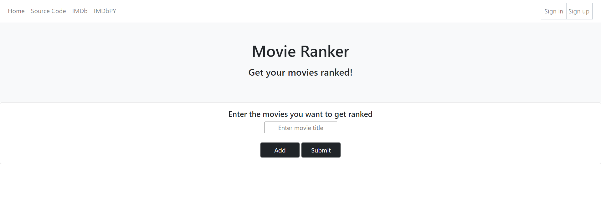
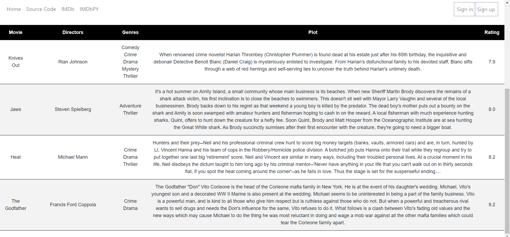

# Movie Ranker

Movie Ranker is a web app that can rank movies based on a 
list you give. This is done with the help of the Python library IMDbPy and Flask.

# Installation

Use the package manager pip to install IMDbPy and Flask
```bash
pip install imdbpy
pip install Flask
```

#Using Movie Ranker
After running the code, open a browser of your choice and go to localhost:5000
Here you will see this page which is the main page.



Enter movie names, TV shows or anime and add more entries by pressing add.
After adding all the entries hit submit to see the list.


You will then get the entries ranked in terms of IMDB ratings from lowest to highest with the directors that worked on the entry,
genre of the entry and a plot description.

